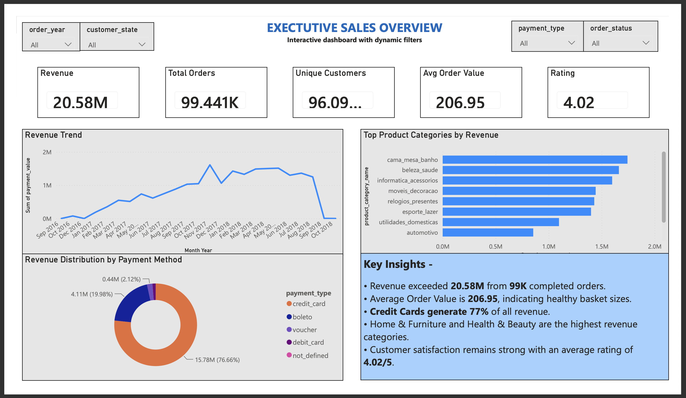
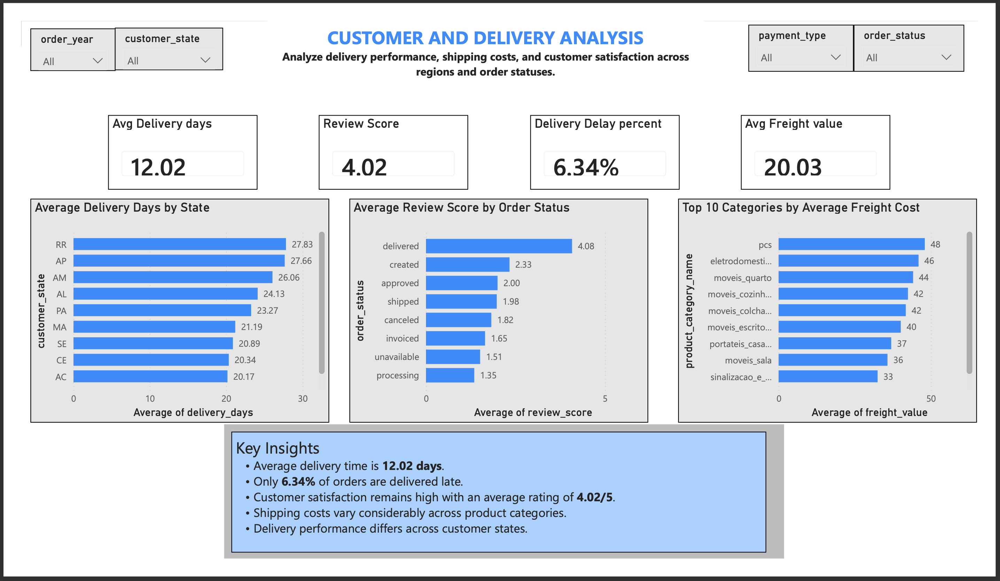

# Retail E-Commerce BI Analytics
### From transactions to decisions.

> **A store does not have a dashboard problem. It has a decision problem.**

This project started with a simple question:

**What can a retail business actually learn when revenue, customers, products, payments, and delivery are treated as one connected story?**

Rather than building another dashboard that begins and ends with KPI cards, I built an end-to-end Business Intelligence workflow around the questions a business would actually ask.

The result is a practical retail analytics project using **Python, SQL, and Power BI** to move from raw e-commerce transactions to evidence, insights, and business decisions.

---

## Why I Built This

I come from a writing and content background, so I care a lot about something that is easy to overlook in analytics: **how a finding is communicated**.

For me, a good dashboard is not a wall of charts. It is a clear conversation between the data and the person who has to make a decision from it.

That idea shaped this project from the beginning.

---

## The Business Lenses

| Lens | What I wanted to understand |
|---|---|
| **Revenue** | Where is the business making money, and how is it changing? |
| **Products** | Which categories contribute most to sales? |
| **Customers** | What does purchasing behaviour tell us about the customer base? |
| **Delivery** | Where does the customer experience break down operationally? |
| **Payments** | How do customers pay, and where is revenue concentrated? |
| **Decisions** | What deserves attention once all these signals are viewed together? |

---

## Analytical Journey

```text
Raw Olist data
      ↓
Understand the data
      ↓
Clean + validate + engineer features
      ↓
Explore patterns in Python
      ↓
Build a SQL analysis layer
      ↓
Translate metrics into business questions
      ↓
Build the Power BI experience
      ↓
Turn evidence into decisions
```

---

## What the Analysis Reveals

The first exploratory pass surfaced useful business signals, but the data-quality audit showed that some headline measures were sensitive to mixed-grain joins.

The project therefore distinguishes between:

- **Merchandise revenue** — calculated from order-item price at item/order grain
- **Payment value** — calculated from payment records at payment/order grain
- **Orders** — distinct `order_id`
- **Delivery metrics** — calculated from eligible order-level timestamps

The earlier exploratory figures of approximately **20.58M revenue** and **6.34% late deliveries are now treated as provisional** until the Power BI model is reconciled against the corrected analytical layer.

The audit also identified **189 source timestamp-sequence anomalies** and **98 orders with payment/item reconciliation differences above R$10**. These records are preserved rather than altered; the analytical model separates the affected measures rather than forcing them to reconcile.

The result is a more defensible foundation for the dashboard: the project does not manufacture cleaner KPIs by overwriting source data.

---

# The Dashboard

## 01 — Executive Sales Overview

The executive view focuses on the commercial heartbeat of the business: revenue, orders, customers, category contribution, payment mix, and movement over time.



### Questions behind the page

- Is revenue growing or slowing?
- Which categories are carrying the business?
- How concentrated is revenue across payment methods?
- Where should an executive look next?

---

## 02 — Customer & Delivery Experience

The second view connects operational performance with the customer experience. Delivery time, late deliveries, ratings, freight costs, geography, and order status are considered together rather than in isolation.



### Questions behind the page

- Where are deliveries taking longer?
- Which regions show higher delay rates?
- What does the delivery experience look like alongside customer ratings?
- Where might logistics performance deserve deeper investigation?

---

# Business Questions Explored

### Commercial
- Which product categories generate the highest revenue?
- How does revenue change over time?
- Where is revenue concentrated?

### Customer
- How do customers purchase?
- What does the review data tell us about customer experience?
- Are operational issues visible in customer outcomes?

### Operations
- What percentage of orders are delivered late?
- Which states experience longer delivery times?
- Which categories carry higher freight costs?

### Payments
- Which payment methods contribute most to revenue?
- How concentrated is payment behaviour?

---

# A Note on Interpretation

The dashboard deliberately separates **what the data shows** from **what a business might choose to do about it**.

For example, a high share of credit-card revenue is a useful observation. It is not, by itself, proof that a new payment incentive would improve profitability.

Likewise, a late-delivery rate is a signal worth investigating, not an explanation of why delays happen.

That distinction matters. Good analytics should make the next question clearer, not pretend every chart contains the answer.

---

# Technical Work

### Python
- Data understanding
- Data cleaning
- Feature engineering
- Exploratory Data Analysis
- Statistical summaries
- Visual exploration

### SQL
- Relational data modelling
- Business queries
- Aggregations and grouping
- Delivery-performance analysis
- Time-based analysis

### Power BI
- KPI design
- Executive dashboarding
- Interactive filtering
- Business-focused visualisation
- Narrative dashboard structure

### Tools
`Python` · `Pandas` · `NumPy` · `SQLite` · `SQLAlchemy` · `Matplotlib` · `Jupyter` · `Power BI` · `Git` · `GitHub`

---

# Notebook Journey

| Notebook | Purpose |
|---|---|
| `00_environment_check.ipynb` | Verify the working environment and dependencies |
| `01_data_understanding.ipynb` | Understand the source data, structure, fields, and relationships |
| `02_data_cleaning_feature_engineering.ipynb` | Clean the data and create analysis-ready features |
| `03_exploratory_data_analysis.ipynb` | Explore revenue, customers, products, payments, delivery, and ratings |
| `04_sql_database_setup.ipynb` | Build the SQL analysis layer and prepare relational analysis |
| `05_data_quality_audit.ipynb` | Test grain, integrity, missingness, value domains, timestamps, reconciliation, and join multiplication |

The notebooks are intentionally kept as a visible trail from **raw data → validation → reasoning → analysis**.

---

# Dataset

**Brazilian E-Commerce Public Dataset by Olist**

The dataset contains approximately 100K orders from Brazilian e-commerce, with information spanning customers, orders, products, payments, reviews, sellers, and logistics.

This project uses the dataset for portfolio and analytical learning purposes.

---

# Repository Structure

```text
Retail-Ecommerce-BI-Analytics/
│
├── data/
│   ├── raw/
│   └── cleaned/
│
├── notebooks/
│   ├── 00_environment_check.ipynb
│   ├── 01_data_understanding.ipynb
│   ├── 02_data_cleaning_feature_engineering.ipynb
│   ├── 03_exploratory_data_analysis.ipynb
│   └── 04_sql_database_setup.ipynb
│
├── dashboard/
│   └── Revenue Pricing Intelligence.pbix
│
├── docs/
│   └── project_summary.md
│
├── images/
│   ├── Executive_Sales_Overview.png
│   └── Customer_and_delivery_analysis.png
│
├── README.md
└── requirements.txt
```

---

# How to Explore the Project

### 1. Clone the repository

```bash
git clone https://github.com/Prabudha-start/Retail-Ecommerce-BI-Analytics.git
cd Retail-Ecommerce-BI-Analytics
```

### 2. Install dependencies

```bash
pip install -r requirements.txt
```

### 3. Follow the notebooks

Start with the environment check, then move through data understanding, cleaning and feature engineering, EDA, and SQL setup.

### 4. Explore Power BI

Open the `.pbix` file in `dashboard/` using Power BI Desktop, or use the exported dashboard images above for a quick view.

---

# What I Would Build Next

This project creates a strong foundation for deeper retail intelligence. Natural next steps include:

- Customer segmentation and cohort analysis
- Profitability and margin analysis
- Sales forecasting
- Inventory optimisation
- Supplier and seller performance
- A pricing scenario simulator

The goal would be to move from **descriptive BI** toward **diagnostic and decision-support analytics**.

---

# One Last Thought

The interesting part of analytics is rarely finding a number.

It is figuring out **why that number deserves attention**.

That is the standard I tried to build into this project.

---

## About Me

**Prabudha Darabare**  
Data Analytics · Business Intelligence · AI & Prompt Engineering

I am transitioning from a senior content and communications background into data analytics, bringing together analytical thinking, business storytelling, and AI-assisted workflows.

- **LinkedIn:** [prabudha-darabare](https://linkedin.com/in/prabudha-darabare)
- **GitHub:** [Prabudha-start](https://github.com/Prabudha-start)

---

*Built with curiosity, SQL, Python, Power BI, and an unreasonable number of questions about what the data is trying to say.*
